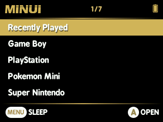
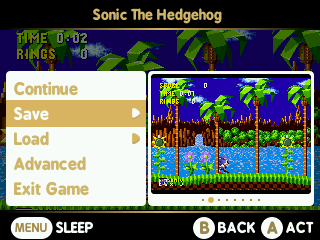

# About MinUI

 

_MinUI is a custom launcher for the [Trimui Model S](http://www.trimui.com/) (aka the PowKiddy A66, sigh)._

I love this little device. I think the hardware is great and that the official firmware has a lot of ambitious ideas. I even like its design. I just wish it were more focused on its unique strengths. I don't think playing console games on a 2" screen with frameskip at 12fps is a great experience. I think selling it as something that plays up to and including PS1 does it a disservice. Where it shines is handheld games. Game Boy and Game Boy Color. Pokémon Mini. Neo Geo Pocket and Neo Geo Pocket Color. Game Gear. (Sorry Japanese friends, I have no experience with the Wonder Swan!) I love that it offers a consistent in-game menu with access to save states (and system-wide volume and brightness button combos). But I think locking players out of each emulator's unique settings was a mistake. MinUI addresses those shortcomings. 

## About paks

In MinUI, applications, programs, or executables are called "paks". A pak is just a folder with the pak extension that contains a launch script. It may also contain an executable and resources required by that executable. 

When you open a rom from a console folder in Roms, MinUI runs the launch script in the corresponding pak in the Emus folder. For example, when you open /Roms/Game Boy/Tetris.gb, MinUI runs /Emus/Game Boy.pak/launch.sh which in turn launches /Emus/Game Boy.pak/gambatte-dms. You can rename the consoles in the Roms folder freely _but you must also rename the corresponding pak in the Emus folder._

Non-emulator programs live in Tools. Native games live in Games.

## For developers

I'd love for you to add the custom in-game menu to your emulator. It can be done in a way that allows the same binary run on non-MinUI devices too. Check out my [libmmenu repo](https://github.com/shauninman/libmmenu) for simple implementation details.
